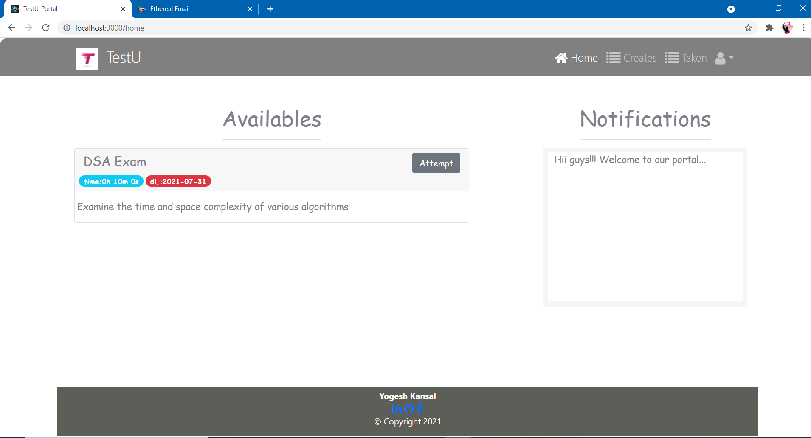
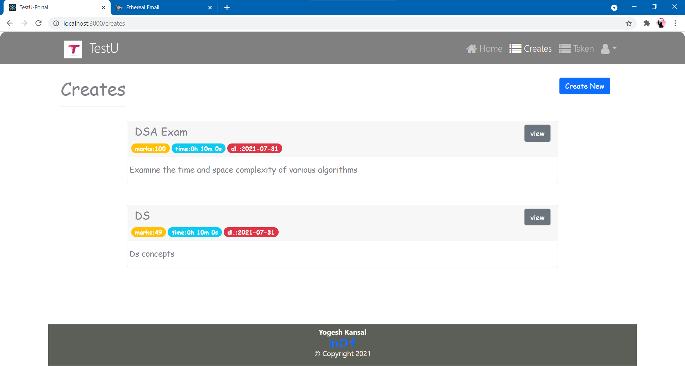
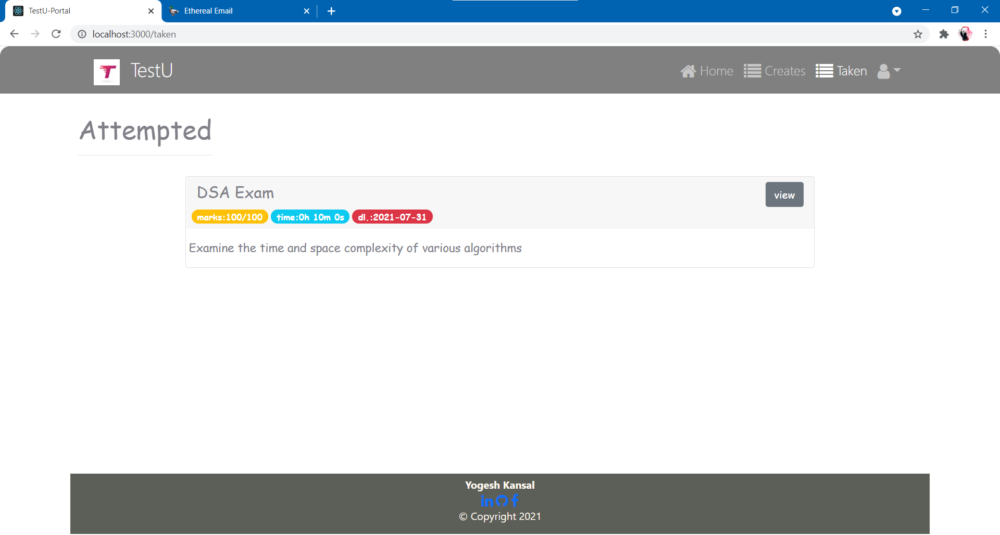
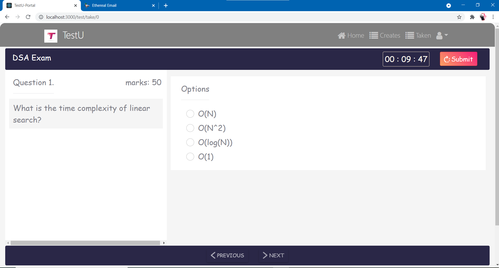
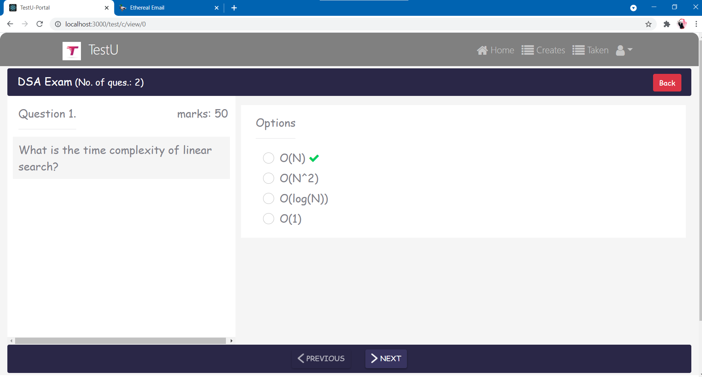
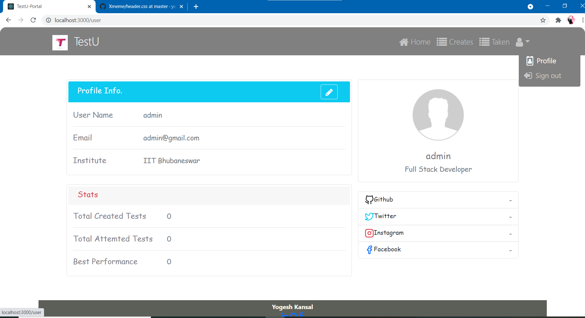
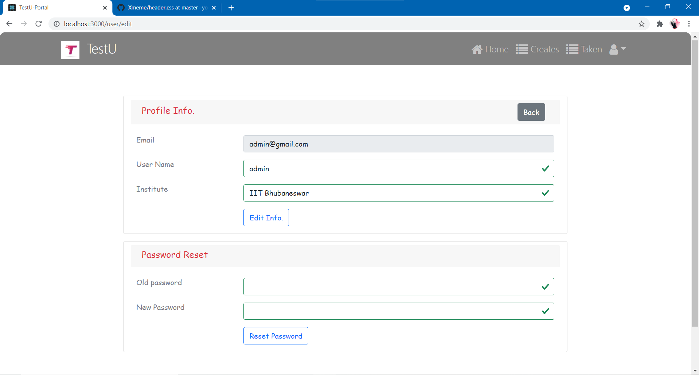
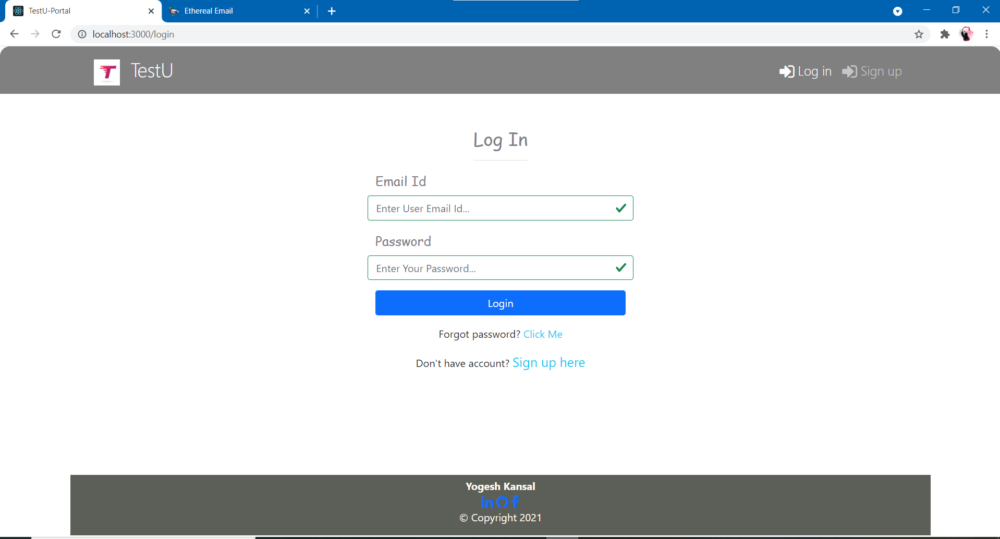
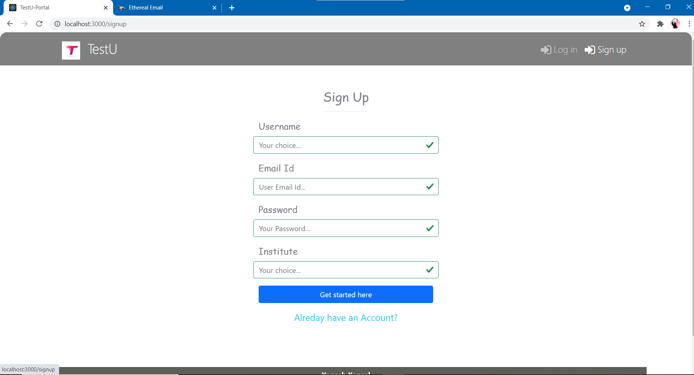

# TestU-Portal
`TestU` is a MERN stack web Portal to conduct online tests for various academic & non-academic subjects where users can set test for a group of people.

## Tech Stack
MERN stack 
Bootstrap5

## Features
- [x] Portal supports user realted tasks such as `user-signup`, `email-verification`,  `user-login`, `update user profile`, `reset password`, `change password` whenever user forgets it (using email id only). 
- [x] The portal allows a user to create an test of dynamic no. of questions for dynamic no. of users. with a specified deadline and time duration. Users who are associated with this exam will be notified through email and then users can attempt the test within deadline. 
- [x] Portal provides facility to attemt test, he can submit it before time as well other wise after time duration test will be submiited automatically. 
- [x] Users will have details of their created tests and he can re-examine this any time. 
- [x] Users will have thier list of attemted tests and he/she can look back them any time 
- [x] Users will have list of test which he can attempt presently.
- [x] User authorization is done using JWT tokens.

`More information related to implementation is provided in respective folders.`

## Demo images
### Home page -

 
 

### List of created tests -

 
 

### List of taken tests -

 
 

### Attempt test -

 
 

### New test -

 
 

### View test -

 
 

### User Profile - 

 
 

### Edit User Profile - 

 
 

### User Login - 

 
 

### User signup - 

 
 