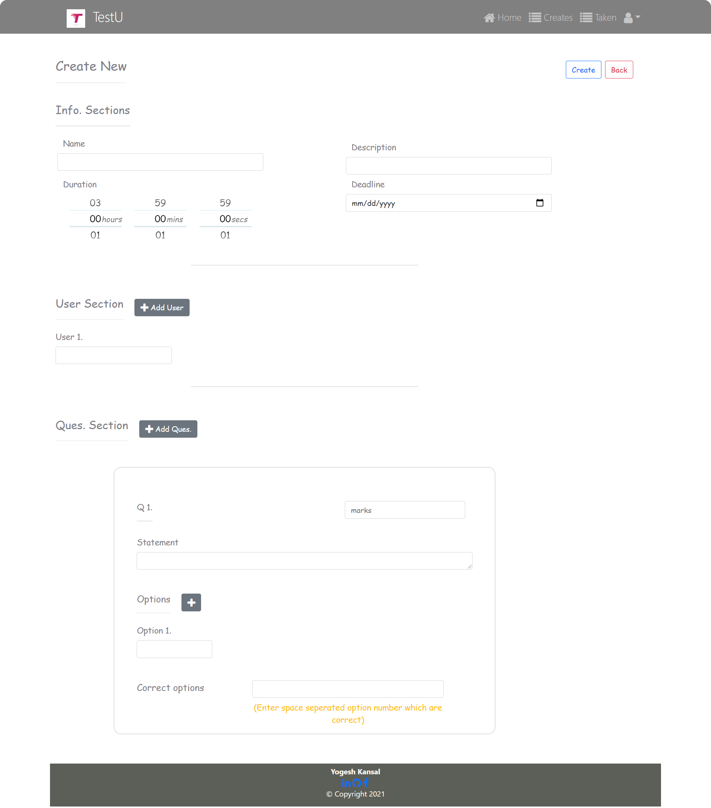

# TestU-Portal [[link](https://testu-portal.netlify.app/)]
`TestU` is a MERN stack web Portal to conduct online tests for various academic & non-academic subjects where users can set tests for a group of people.

## Tech Stack
MERN stack 
Bootstrap5

## Features
- [x] Portal supports user-related tasks such as `user-signup`, `email-verification`,  `user-login`, `update user profile`, `reset password`, `change password` whenever the user forgets it (using email id only). 
- [x] The Portal allows a user to create a test of dynamic no. of questions for dynamic no. of users with a specified deadline and time duration. Users associated with this exam will be notified through email, and then users can attempt the test within the deadline. 
- [x] Portal provides a facility to attempt the test. He can submit it before time as well; otherwise, after time duration test will be submitted automatically. 
- [x] Users will have details of their created tests, and he can re-examine this any time. 
- [x] Users will have their list of attempted tests, and they can look back at them any time 
- [x] Users will have a list of tests they can attempt presently.
- [x] User authorization is done using JWT tokens.

`More information related to implementation is provided in respective folders.`

## Demo images
### Home page -

 
 

### List of created tests -

 
 

### List of taken tests -

 
 

### Attempt test -

 
 

### New test -

 
 

### View test -

 
 

### User Profile - 

 
 

### Edit User Profile - 

 
 

### User Login - 

 
 

### User signup - 

 
 